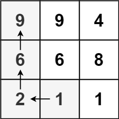
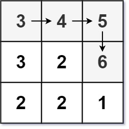
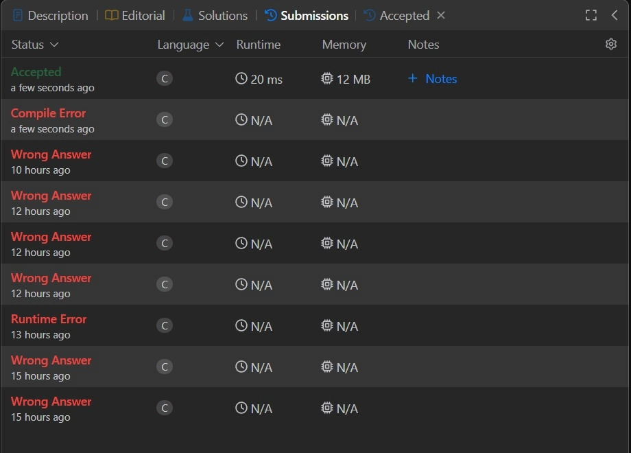

## #329 Longest Increasing Path in a Matrix

[Link para a questão](https://leetcode.com/problems/longest-increasing-path-in-a-matrix/description/)

### Gravação
[Vídeo da explicação](https://www.youtube.com/watch?v=aCFagIpCzoE)

#### Dificuldade: Difícil

### Enunciado

Given an m x n integers matrix, return the length of the longest increasing path in matrix.

From each cell, you can either move in four directions: left, right, up, or down. You may not move diagonally or move outside the boundary (i.e., wrap-around is not allowed).

 

Example 1:

Input: matrix = [[9,9,4],[6,6,8],[2,1,1]]
Output: 4
Explanation: The longest increasing path is [1, 2, 6, 9].

Example 2:

Input: matrix = [[3,4,5],[3,2,6],[2,2,1]]
Output: 4
Explanation: The longest increasing path is [3, 4, 5, 6]. Moving diagonally is not allowed.

Example 3:

Input: matrix = [[1]]
Output: 1

Constraints:

    m == matrix.length
    n == matrix[i].length
    1 <= m, n <= 200
    0 <= matrix[i][j] <= 231 - 1

### Submissões: 

