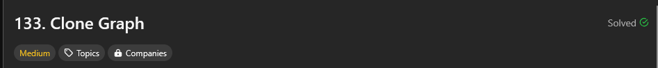
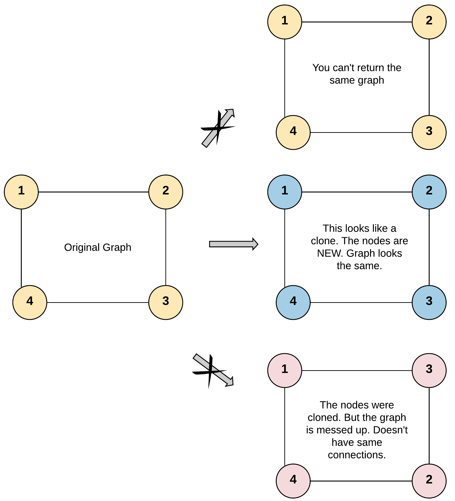
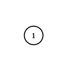
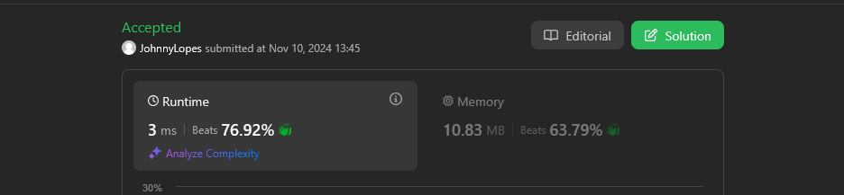
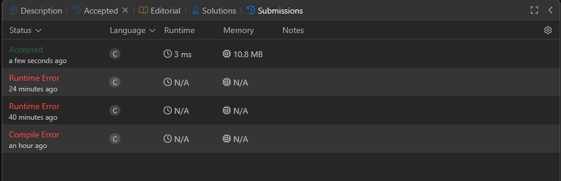

## #329 Longest Increasing Path in a Matrix

[Link para a questão](https://leetcode.com/problems/clone-graph/description/)

### Gravação
[Vídeo da explicação]([hhttps://youtu.be/SnqQ1pZYjXM?feature=shared](https://www.youtube.com/watch?v=SnqQ1pZYjXM))

#### Dificuldade: Média

### Enunciado

Given a reference of a node in a connected undirected graph.

Return a deep copy (clone) of the graph.

Each node in the graph contains a value (int) and a list (List[Node]) of its neighbors.

`class Node {
    public int val;
    public List<Node> neighbors;
}`

<strong>Test case format:</strong>

For simplicity, each node's value is the same as the node's index (1-indexed). For example, the first node with `val == 1`, the second node with `val == 2`, and so on. The graph is represented in the test case using an adjacency list.

An adjacency list is a collection of unordered lists used to represent a finite graph. Each list describes the set of neighbors of a node in the graph.

The given node will always be the first node with `val = 1`. You must return the copy of the given node as a reference to the cloned graph.

Example 1:

 Input: adjList = [[2,4],[1,3],[2,4],[1,3]]
 Output: [[2,4],[1,3],[2,4],[1,3]]
 Explanation: There are 4 nodes in the graph.

 1st node (val = 1)'s neighbors are 2nd node (val = 2) and 4th node (val = 4).
 2nd node (val = 2)'s neighbors are 1st node (val = 1) and 3rd node (val = 3).
 3rd node (val = 3)'s neighbors are 2nd node (val = 2) and 4th node (val = 4).
 4th node (val = 4)'s neighbors are 1st node (val = 1) and 3rd node (val = 3).

Example 2:

 Input: adjList = [[]]
 Output: [[]]
 Explanation: Note that the input contains one empty list. The graph consists of only one node with val = 1 and it does not have any neighbors.

Example 3:

 Input: adjList = []
 Output: []
 Explanation: This an empty graph, it does not have any nodes.

Constraints:

    The number of nodes in the graph is in the range [0, 100].
    1 <= Node.val <= 100
    Node.val is unique for each node.
    There are no repeated edges and no self-loops in the graph.
    The Graph is connected and all nodes can be visited starting from the given node.

### Submissões: 

